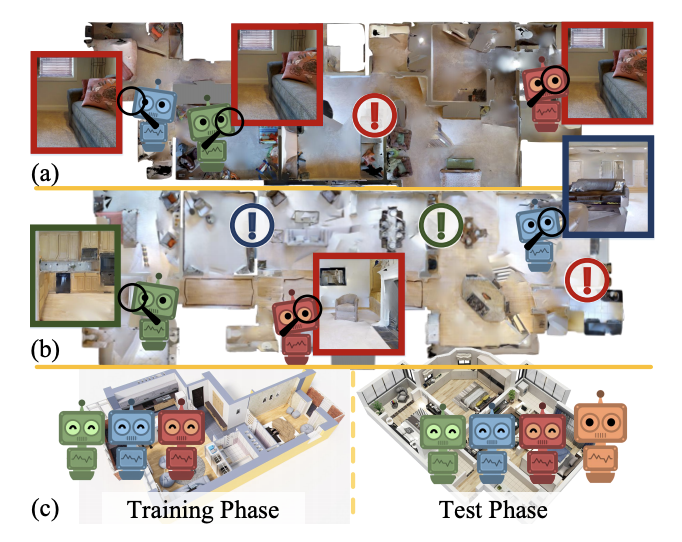

#  Collaborative Visual Navigation


## Introduction

CollaVN is a visual MARL dataset, created for the development of intelligent, cooperative navigation agents.

Authors: Haiyang Wang, Wenguan Wang, Jifeng Dai, Xizhou Zhu, Liwei Wang

[[arxiv]](https://arxiv.org/abs/2107.01151)

### Latest Updates
[08/17/2021] Release CollaVN V1 dataset


### Citation
If you use CollaVN and models, consider citing the following publication:

```
@article{wang2021collaborative,
  title={Collaborative Visual Navigation},
  author={Wang, Haiyang and Wang, Wenguan and Zhu, Xizhou and Dai, Jifeng and Wang, Liwei},
  journal={arXiv preprint arXiv:2107.01151},
  year={2021}
}
```

## Installation

The code is tested under the following environment:

- Ubuntu 16.04 LTS
- Python 3.6
- Pytorch 1.8.0
- CUDA 11.1
- GCC 7.3

### Install required package
```shell
conda install pytorch==1.8.0 torchvision==0.9.0 torchaudio==0.8.0 cudatoolkit=11.1 -c pytorch -c conda-forge

pip install scikit-image
```
### Install MAVN

```shell
git clone https://github.com/Haiyang-W/MAVN.git

cd MAVN

# if you didn't create the conda environment before:
conda create -y -n MAVN python=3.6
conda activate MAVN

pip install -e . 
```
### Note
If you have problem in openGL, please see [[Trouble Shooting]](http://svl.stanford.edu/igibson/docs/issues.html)

### Presample Datapoint
To make the comparison fair, we pre-generated some data points, which we used in our paper, please see dataset dir.
[Google Drive](https://drive.google.com/drive/folders/1xYzl5zBYOfTE2ouSIKgp6ZgrQ7lZEe7X?usp=sharing)

```shell
cd MAVN
wget https://drive.google.com/drive/folders/1xYzl5zBYOfTE2ouSIKgp6ZgrQ7lZEe7X?usp=sharing
```

## Run Demo
```shell
python demo.py -n1 --auto_gpu_config 1 --total_num_scenes 1 --task_config ./config/CommonGoal_two_locobot.yaml
```

## TODO:
Release CollaVN V2 and method code

## Acknowledgments

Our code is heavily based on [iGibson](https://github.com/StanfordVL/iGibson). Thanks iGibson Development Team for their awesome codebase.
